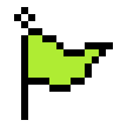

# AWS.RES-BASH.CTF

<div align="center">
    
  </a>
  <h3 align="center">Welcome to the AWS Re/start BASH CTF</h3>
 
 <!-- ABOUT THE PROJECT -->
## What's a CTF

A CTF or Capture The Flag, is a game like environment in which you have a series of challenges (think of them like small exercices)
you must solve in order to find a "flag"

For this CTF a flag will look something like this : 

*Flag number 0 :
  ```sh
    1fxfDQbW8LJ97VHcYxDmHREdDQLQZAOo
  ```
  
 it's a 32 characters long string that is unique to each challenge.
 You must find the flag for challenge 1 to get to challenge 2.
 
 <!-- Prerequisites -->
## Prerequisites

We will need the command SSH (Secure Shell) to access the challenges :

  ```sh
    ssh <USERNEAME>@bandit.labs.overthewire.org -p 2220
  ```
Replace <USERNAME> with bandit0 for the first challenge and bandit<Number> for all subsequent challenges
this can be done in one of 3 ways

### Using one of the Linux labs as a plateform

Open the Lab number (41-[LX]-Lab - Bash Shell Scripts)[https://awsrestart.instructure.com/courses/965/modules/items/448683] 

Reminder : This lab has a timer limit of 25 min

<div align="center">
    
  </a>

### Using the application Putty on windows

1. Download PuTTY to SSH into the CTF : (Download link)[https://the.earth.li/~sgtatham/putty/latest/w64/putty.exe]

2. Launch putty.exe

3. Configure PuTTY timeout to keep the PuTTY session open for a longer period of time:

    Click Connection.
    Set Seconds between keepalives to 30
 
<div align="center">
    
  </a>
  
4. Input SSH Informations

  ```sh
    Host: bandit.labs.overthewire.org
    Port: 2220
  ```
<div align="center">
    
  </a>

### Using SSH directly from you Linux or Mac
  
You know what to do 😂 same as the lab uptop open a terminal and ssh into the server.


 <!-- Getting started-->
## Getting Started

**IMPORTANT** : Please save your flags in a text file to not lose them if you get disconnected.
  
### Challenge 0
  
You get a free flag this time 😄 the password is : bandit0

🚩 You can submit your flag here : (SUBMIT FLAG0)[google.com]
  
### Challenge level 0 -> level 1
  
  Login to the server using the previous flag
  ```sh
    ssh bandit0@bandit.labs.overthewire.org -p 2220
  ```
  **Level Goal**

The password for the next level is stored in a file called **readme** located in the home directory. 
Use this password to log into bandit1 using SSH. Whenever you find a password for a level, use SSH (on port 2220) to log into that level and continue the game.

  **Commands you may need to solve this level**

ls, cd, cat, file, du, find
  
🚩 You can submit your flag here : (SUBMIT FLAG1)[google.com]
  
### Challenge level 1 -> level 2
  
  Login to the server using the previous flag
  ```sh
    ssh bandit1@bandit.labs.overthewire.org -p 2220
  ```
**Level Goal**
  
  The password for the next level is stored in a file called **-** located in the home directory
  
**Commands you may need to solve this level**

ls, cd, cat, file, du, find

  **Helpful Reading Material**

    Google Search for “dashed filename”
    Advanced Bash-scripting Guide - Chapter 3 - Special Characters

🚩 You can submit your flag here : (SUBMIT FLAG2)[google.com]
