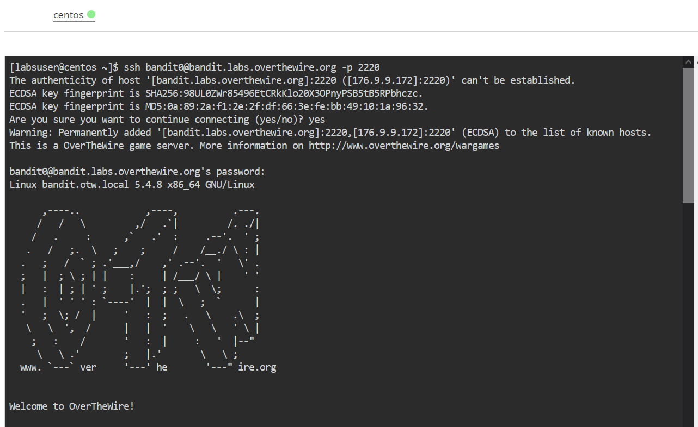
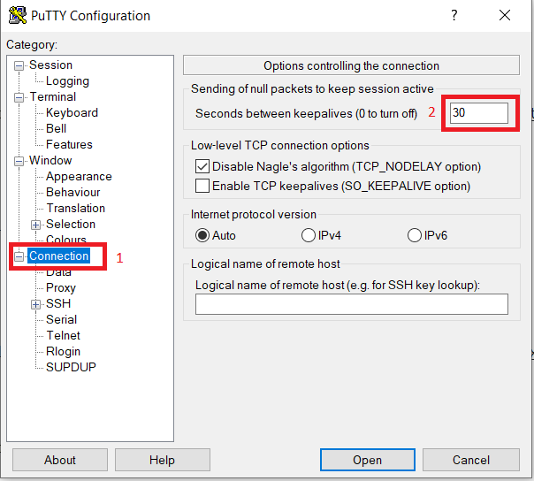
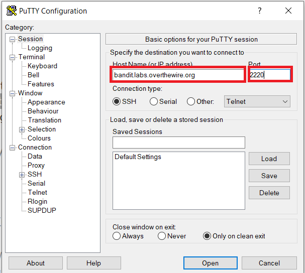

#     Welcome to the AWS Re/start BASH CTF
 
<!-- ABOUT THE PROJECT -->
## What's a CTF

A CTF (Capture The Flag), is a game like environment in which you have to face a series of challenges,<br />
think of them like small exercices you must solve in order to find a **flag** 🚩.<br />

For this CTF a flag will look something like this : 

**Flag number X :**
  ```sh
    1fxfDQbW8LJ97VHcYxDmHREdDQLQZAOo
  ```
  
It's a 32 characters long string that is unique to each challenge.<br />
You must find the flag for challenge 1 to get to challenge 2.

There are 10 Flags ( 0 -> 9 ) to be captured + 3 Bonus ones. Good luck!
 
 <!-- Prerequisites -->
## Prerequisites

We will need the command SSH (Secure Shell) to access the challenges :

  ```sh
    ssh <USERNEAME>@bandit.labs.overthewire.org -p 2220
  ```
Replace `USERNAME` with `bandit0` for the first challenge and `bandit<Number>` for all subsequent challenges.

This can be done in one of 3 ways :

### Using one of the Linux labs as a plateform

Open the Lab number [41 Lab - Bash Shell Scripts](https://awsrestart.instructure.com/courses/965/modules/items/448681)

Reminder : This lab has a timer limit of 25 min



### Using the application Putty on windows

1. Download PuTTY to SSH into the CTF : [Download link](https://the.earth.li/~sgtatham/putty/latest/w64/putty.exe)

2. Launch putty.exe

3. Configure PuTTY timeout to keep the PuTTY session open for a longer period of time:

    Click Connection.
    Set Seconds between keepalives to 30
 


  
4. Input SSH Informations

  ```sh
    Host: bandit.labs.overthewire.org
    Port: 2220
  ```


### Using SSH directly from you Linux or Mac
  
You know what to do 😂 same as the lab uptop open a terminal and ssh into the server.

<br />
<br />

 <!-- Getting started-->
## Getting Started

**IMPORTANT** : 
> Please save your flags in a text file to not lose them if you get disconnected.
  
## Challenge 0
  
You get a free flag this time 😄 the password is : bandit0

🚩 You can submit your flag here : [SUBMIT FLAG 0](https://forms.gle/KEWbsJAuSmtWPyD29)
  
## Challenge level 0 -> level 1
  
  Login to the server using the previous flag
  ```sh
    ssh bandit0@bandit.labs.overthewire.org -p 2220
  ```
  **Level Goal**

   The password for the next level is stored in a file called **readme** located in the home directory.<br /> 
   Use this password to log into bandit1 using SSH. <br />
   Whenever you find a password for a level, use SSH (on port 2220) to log into that level and continue the game.

  **Commands you may need to solve this level**
```
ls, cd, cat, file, du, find
```
  
🚩 You can submit your flag here : [SUBMIT FLAG 1 (1pt) ](https://forms.gle/rP3y1Cw9uBR5wJrB7)
  
## Challenge level 1 -> level 2
  
  Login to the server using the previous flag
  ```sh
    ssh bandit1@bandit.labs.overthewire.org -p 2220
  ```
**Level Goal**
  
  The password for the next level is stored in a file called **-** located in the home directory.
  
**Commands you may need to solve this level**
```
ls, cd, cat, file, du, find
```
<details>
 <summary>Hint 🐸</summary>
   **Helpful Reading Material**

    Google Search for “dashed filename”
    Advanced Bash-scripting Guide - Chapter 3 - Special Characters
</details>

🚩 You can submit your flag here : [SUBMIT FLAG 2 (2pts)](https://forms.gle/Ho7xrQMN964xQ6sW9)

## Challenge level 2 -> level 3
  
  Login to the server using the previous flag
  ```sh
    ssh bandit2@bandit.labs.overthewire.org -p 2220
  ```
**Level Goal**
  
The password for the next level is stored in a file called `spaces in this filename` located in the home directory
  
**Commands you may need to solve this level**
```
ls, cd, cat, file, du, find
```
<details>
 <summary>Hint 🐸</summary>
  **Helpful Reading Material**

    Google Search for “spaces in filename”
</details>

🚩 You can submit your flag here : [SUBMIT FLAG 3 (2pts)](https://forms.gle/iJnremy5yLETPNCe8)

## Challenge level 3 -> level 4
  
  Login to the server using the previous flag
  ```sh
    ssh bandit3@bandit.labs.overthewire.org -p 2220
  ```
**Level Goal**
  
The password for the next level is stored in a hidden file in the `inhere` directory.
  
**Commands you may need to solve this level**
```
ls, cd, cat, file, du, find
```
<details>
 <summary>Hint 🐸</summary>
 None
</details>

🚩 You can submit your flag here : [SUBMIT FLAG 4 (2pts)](https://forms.gle/dSE5ZybuqeyFBave9)

## Challenge level 4 -> level 5
  
  Login to the server using the previous flag
  ```sh
    ssh bandit4@bandit.labs.overthewire.org -p 2220
  ```
**Level Goal**
  
The password for the next level is stored in the only human-readable file in the inhere directory. 

**Tip:** if your terminal is messed up, try the `reset` command.
  
**Commands you may need to solve this level**
```
ls, cd, cat, file, du, find
```
<details>
 <summary>Hint 🐸</summary>
 Google search for "How to find File Types in Linux"
</details>

🚩 You can submit your flag here : [SUBMIT FLAG 5 (5pts)](https://forms.gle/jbjYLqZ2vnqPd7FZ9)


## Challenge level 5 -> level 6
  
  Login to the server using the previous flag
  ```sh
    ssh bandit5@bandit.labs.overthewire.org -p 2220
  ```
**Level Goal**
  
The password for the next level is stored in a file somewhere under the inhere directory and has all of the following properties:
```
    human-readable
    1033 bytes in size
    not executable
```
  
**Commands you may need to solve this level**
```
ls, cd, cat, file, du, find, grep
```
<details>
 <summary>Hint 🐸 #1</summary>
  
 Try to "find" a way to look for the specific file with the properties given. 
</details>
<details>
 <summary>Hint 🐧🐧 #2</summary>
  
 Read the manual for the command find. 
</details>

🚩 You can submit your flag here : [SUBMIT FLAG 6 (7pts)](https://forms.gle/i2QsDME75yiJVaVj8)

## Challenge level 6 -> level 7
  
  Login to the server using the previous flag
  ```sh
    ssh bandit6@bandit.labs.overthewire.org -p 2220
  ```
**Level Goal**
  
The password for the next level is stored somewhere on the server and has all of the following properties:

```
    owned by user bandit7
    owned by group bandit6
    33 bytes in size
```
  
**Commands you may need to solve this level**
```
ls, cd, cat, file, du, find, grep
```
<details>
 <summary>Hint 🐸</summary>
  
 Pretty similar to before, just read the manual again. 
</details>

🚩 You can submit your flag here : [SUBMIT FLAG 7 (7pts)](https://forms.gle/n3MaLzfwmJf5mM4c9)

## Challenge level 7 -> level 8
  
  Login to the server using the previous flag
  ```sh
    ssh bandit7@bandit.labs.overthewire.org -p 2220
  ```
**Level Goal**
  
The password for the next level is stored in the file `data.txt` next to the word `millionth`
  
**Commands you may need to solve this level**
```
grep, sort, uniq, strings, base64, tr, tar, gzip, bzip2, xxd
```
<details>
 <summary>Hint 🐈😺😹</summary>
 
  
  
  Grep Grep
</details>

🚩 You can submit your flag here : [SUBMIT FLAG 8 (7pts)](https://forms.gle/Ru8duYF4NvYJucLD6)

## Challenge level 8 -> level 9
  
  Login to the server using the previous flag
  ```sh
    ssh bandit8@bandit.labs.overthewire.org -p 2220
  ```
**Level Goal**
  
The password for the next level is stored in the file `data.txt` and is the only line of text that **occurs only once**
  
**Commands you may need to solve this level**
```
grep, sort, uniq, strings, base64, tr, tar, gzip, bzip2, xxd
```
<details>
 <summary>Hint #1 🐸</summary>
  
</details>

<details>
 <summary>Hint #2 🐸🐸</summary>
  
</details>

<details>
 <summary>Hint #3 🐸🐸🐸</summary>
  
</details>

🚩 You can submit your flag here : [SUBMIT FLAG 9](https://forms.gle/6YDbbg1h5fnMVBNv6)


## Bonus Challenge #1
  
  Download this file using one of these commands `wget` or `curl`
  
```
  wget https://github.com/msfellag/AWS.RES-BASH.CTF/raw/main/files/bonusChallengeNumberOne
```
  
**Level Goal**
  
The password is inside the file `bonusChallengeNumberOne`
  
<details>
 <summary>Hint #1</summary>
  Remember Challenge level 5 -> level 6
</details>


🚩 You can submit your flag here : [SUBMIT BONUS FLAG 1](https://forms.gle/5zYfRcHHwQMMdo8V8)

## Bonus Challenge #2
  
  Download this file using one of these commands `wget` or `curl`
  
```
  wget https://github.com/msfellag/AWS.RES-BASH.CTF/raw/main/files/bonusChallengeNumberTwo
```
  
**Level Goal**
  
The password is the output of the script `bonusChallengeNumberTwo.sh` once executed
  
<details>
 <summary>Hint #1</summary>
None.
</details>


🚩 You can submit your flag here : [SUBMIT BONUS FLAG 2](https://forms.gle/EkseAMEBUS7WpLmf8)

## Bonus Challenge #3
  
  Download this file using one of these commands `wget` or `curl`
  
```
  wget https://github.com/msfellag/AWS.RES-BASH.CTF/raw/main/files/bonusChallengeNumberThree
```
  
**Level Goal**
  
The password is the checksum of the file `bonusChallengeNumberThree` once executed
  
<details>
 <summary>Hint #1</summary>
None.
</details>


🚩 You can submit your flag here : [SUBMIT BONUS FLAG 3](https://forms.gle/hHm55hkbiG39axX27)


