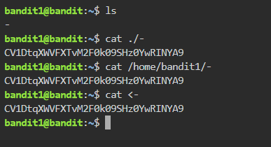
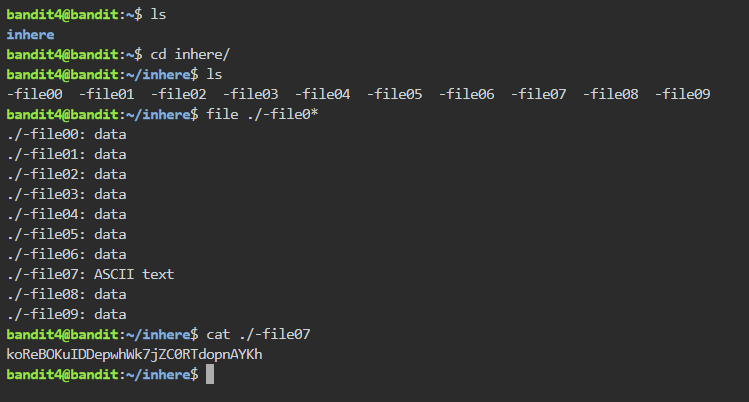
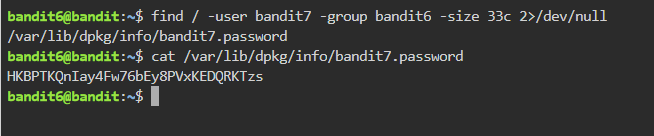
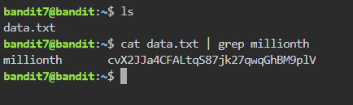
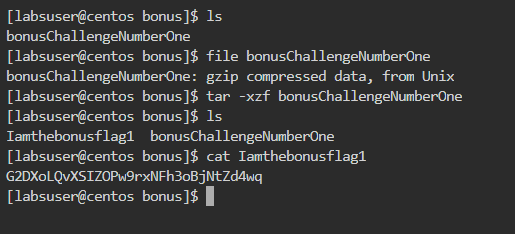
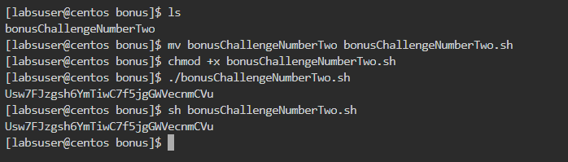

### Info

```
    0: stdin
    1: stdout
    2: stderr
```

`CTRL+C` to cancel command if you are stuck
`CTRL+L` or `clear` to clear the screen

## Level 0

Username: bandit0

Password: bandit0 

##  Level 0 → Level 1

`ls` to find the file and `cat` to output it's contents to the stdout (standard output)


## Level 1 → Level 2

This challenge can be solved in many ways :



## Level 2 → Level 3


## Level 3 → Level 4


## Level 4 → Level 5

This one has many possible solutions as well but you will need the command `file` for most of them



This one uses an in-line script to loop through the files (i honestly prefer the first one)


## Level 5 → Level 6


**-type f** : means search only for files
**-size 1033c** : means the files must have a size of 1033 bytes
**! -executable** : means not an executable

A second way of doing it (like Cyrine tried to do, but sorry i forgot to add the argument `a` to ls because the file is hidden)


## Level 6 → Level 7



Find arguments explained :

**/** search from root folder onward (the whole server basically)

**-user** the owner of the file.

**-group** the group owner of the file.

**-size** the size of the file and **c** means bytes

**2>/dev/null** redirects error messages instead from printing them to terminal (stdout) to **/dev/null** a special empty place for linux.


## Level 7 → Level 8

a simple `cat` and `grep` with a pipe.



## Level 8 → Level 9

For `uniq -u` to do it's job we have to `sort` the file fist and so we do !


## Bonus level 1

First : We have to install Wget first using Yum the package manager for CentOS

```
sudo yum install wget

wget https://github.com/msfellag/AWS.RES-BASH.CTF/raw/main/files/bonusChallengeNumberOne
```

then we identify the mysterious file format and unzip and decompress it to look inside



## Bonus level 2

```
  wget https://github.com/msfellag/AWS.RES-BASH.CTF/raw/main/files/bonusChallengeNumberTwo
```
you could either use `sh <filename>` or `chmod +x <filename>` and then `sh <filename>` both solutions are correct
renaming the file with `mv` is just for you own convinience and not necessary



## Bonus level 2

```
  wget https://github.com/msfellag/AWS.RES-BASH.CTF/raw/main/files/bonusChallengeNumberThree
```


Hope this was fun and informative for you.
